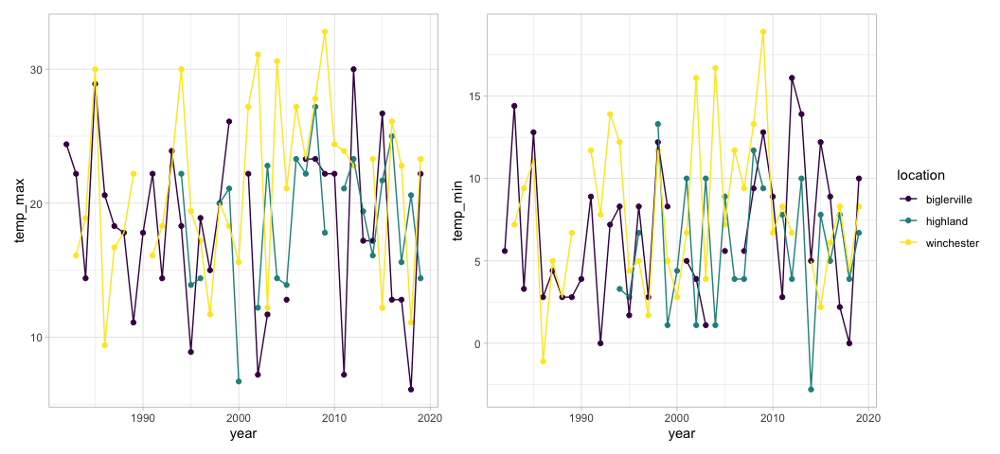
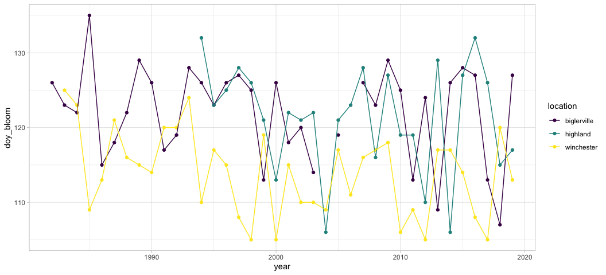
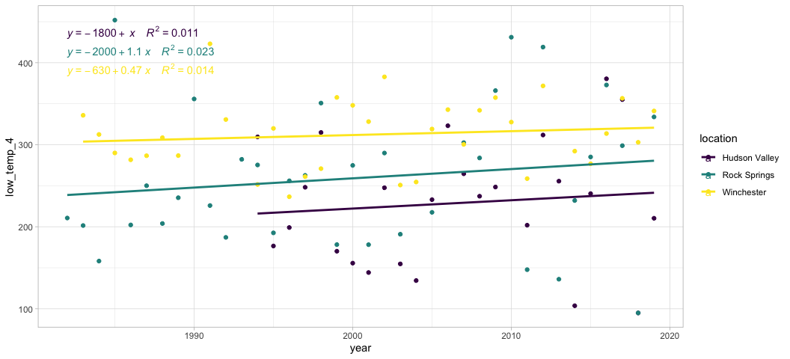
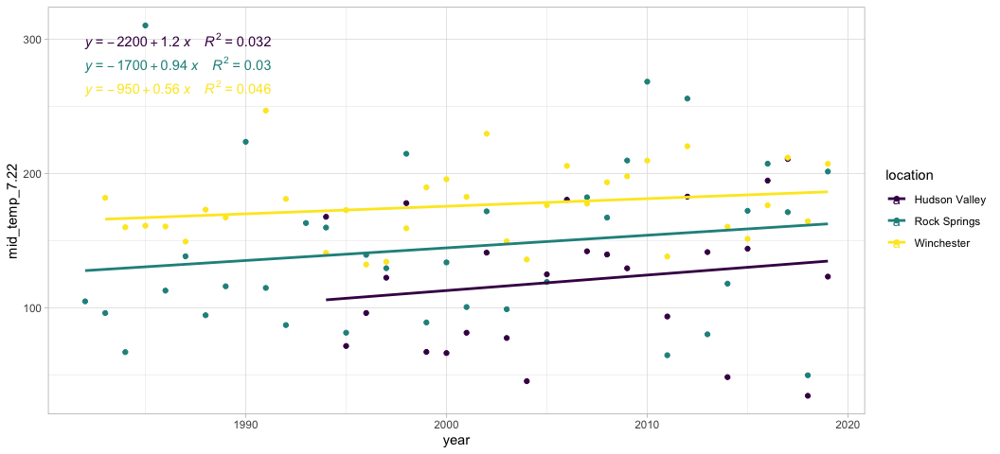
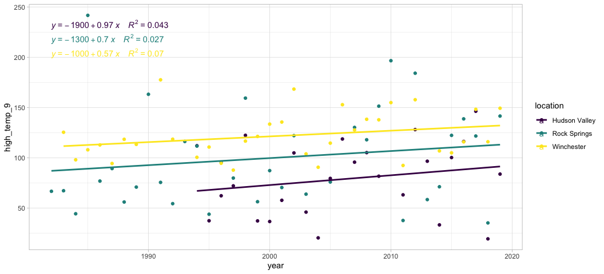

Apple bloom plots
================
Sam Muir
7/15/2022

## Historical Temperature Trends

<!-- -->

## Day of Full Bloom

<!-- -->

## Growing Degree Days

# Using 4ºC

<!-- -->

# Using 7.22ºC

<!-- -->

# Using 9ºC

<!-- -->
